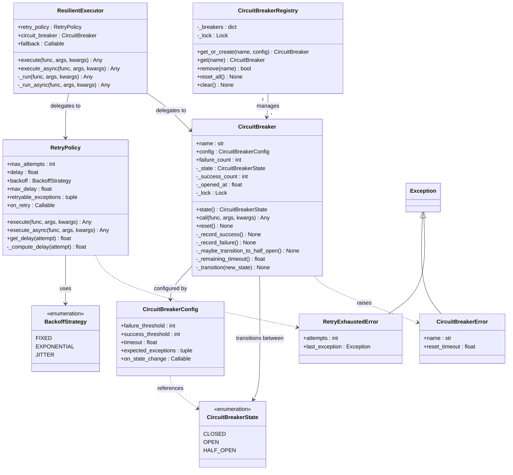

# Class Diagram — Internal Architecture

Full internal class diagram including private members, not exposed to end-users.

```mermaid
classDiagram
    direction TB

    class CircuitBreakerState {
        <<enumeration>>
        CLOSED
        OPEN
        HALF_OPEN
    }

    class CircuitBreakerConfig {
        +failure_threshold : int
        +success_threshold : int
        +timeout : float
        +expected_exceptions : tuple
        +on_state_change : Callable
    }

    class CircuitBreaker {
        +name : str
        +config : CircuitBreakerConfig
        +failure_count : int
        -_state : CircuitBreakerState
        -_success_count : int
        -_opened_at : float
        -_lock : Lock
        +state() CircuitBreakerState
        +call(func, args, kwargs) Any
        +reset() None
        -_record_success() None
        -_record_failure() None
        -_maybe_transition_to_half_open() None
        -_remaining_timeout() float
        -_transition(new_state) None
    }

    class BackoffStrategy {
        <<enumeration>>
        FIXED
        EXPONENTIAL
        JITTER
    }

    class RetryPolicy {
        +max_attempts : int
        +delay : float
        +backoff : BackoffStrategy
        +max_delay : float
        +retryable_exceptions : tuple
        +on_retry : Callable
        +execute(func, args, kwargs) Any
        +execute_async(func, args, kwargs) Any
        +get_delay(attempt) float
        -_compute_delay(attempt) float
    }

    class ResilientExecutor {
        +retry_policy : RetryPolicy
        +circuit_breaker : CircuitBreaker
        +fallback : Callable
        +execute(func, args, kwargs) Any
        +execute_async(func, args, kwargs) Any
        -_run(func, args, kwargs) Any
        -_run_async(func, args, kwargs) Any
    }

    class CircuitBreakerRegistry {
        -_breakers : dict
        -_lock : Lock
        +get_or_create(name, config) CircuitBreaker
        +get(name) CircuitBreaker
        +remove(name) bool
        +reset_all() None
        +clear() None
    }

    class CircuitBreakerError {
        +name : str
        +reset_timeout : float
    }

    class RetryExhaustedError {
        +attempts : int
        +last_exception : Exception
    }

    CircuitBreaker --> CircuitBreakerConfig       : configured by
    CircuitBreaker --> CircuitBreakerState        : transitions between
    CircuitBreakerConfig ..> CircuitBreakerState  : references

    RetryPolicy --> BackoffStrategy               : uses

    ResilientExecutor --> RetryPolicy             : delegates to
    ResilientExecutor --> CircuitBreaker          : delegates to

    CircuitBreakerRegistry "1" --> "*" CircuitBreaker : manages

    CircuitBreaker    ..> CircuitBreakerError     : raises
    RetryPolicy       ..> RetryExhaustedError     : raises

    Exception <|-- CircuitBreakerError
    Exception <|-- RetryExhaustedError
```
