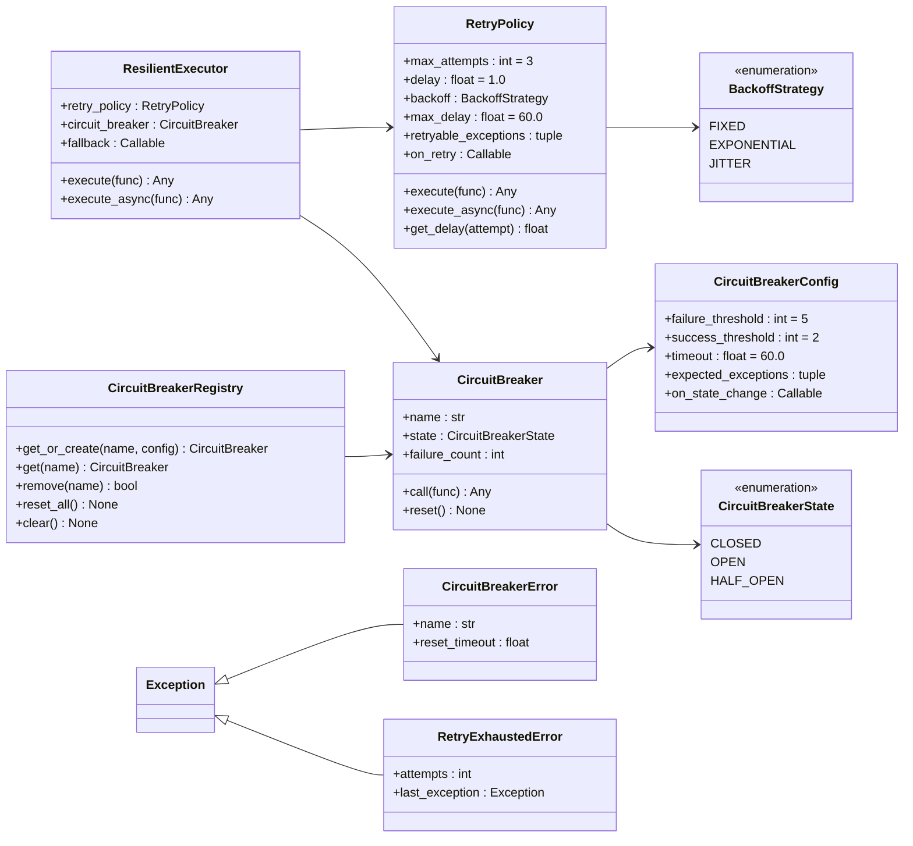

# Class Diagram — Public API

Simplified view exposed to end-users. Private members and internal helpers are hidden.

```mermaid
classDiagram
    direction LR

    class CircuitBreaker {
        +name : str
        +state : CircuitBreakerState
        +failure_count : int
        +call(func) Any
        +reset() None
    }

    class CircuitBreakerConfig {
        +failure_threshold : int = 5
        +success_threshold : int = 2
        +timeout : float = 60.0
        +expected_exceptions : tuple
        +on_state_change : Callable
    }

    class CircuitBreakerState {
        <<enumeration>>
        CLOSED
        OPEN
        HALF_OPEN
    }

    class RetryPolicy {
        +max_attempts : int = 3
        +delay : float = 1.0
        +backoff : BackoffStrategy
        +max_delay : float = 60.0
        +retryable_exceptions : tuple
        +on_retry : Callable
        +execute(func) Any
        +execute_async(func) Any
        +get_delay(attempt) float
    }

    class BackoffStrategy {
        <<enumeration>>
        FIXED
        EXPONENTIAL
        JITTER
    }

    class ResilientExecutor {
        +retry_policy : RetryPolicy
        +circuit_breaker : CircuitBreaker
        +fallback : Callable
        +execute(func) Any
        +execute_async(func) Any
    }

    class CircuitBreakerRegistry {
        +get_or_create(name, config) CircuitBreaker
        +get(name) CircuitBreaker
        +remove(name) bool
        +reset_all() None
        +clear() None
    }

    class CircuitBreakerError {
        +name : str
        +reset_timeout : float
    }

    class RetryExhaustedError {
        +attempts : int
        +last_exception : Exception
    }

    CircuitBreaker --> CircuitBreakerConfig
    CircuitBreaker --> CircuitBreakerState
    RetryPolicy --> BackoffStrategy
    ResilientExecutor --> RetryPolicy
    ResilientExecutor --> CircuitBreaker
    CircuitBreakerRegistry --> CircuitBreaker
    Exception <|-- CircuitBreakerError
    Exception <|-- RetryExhaustedError
```
