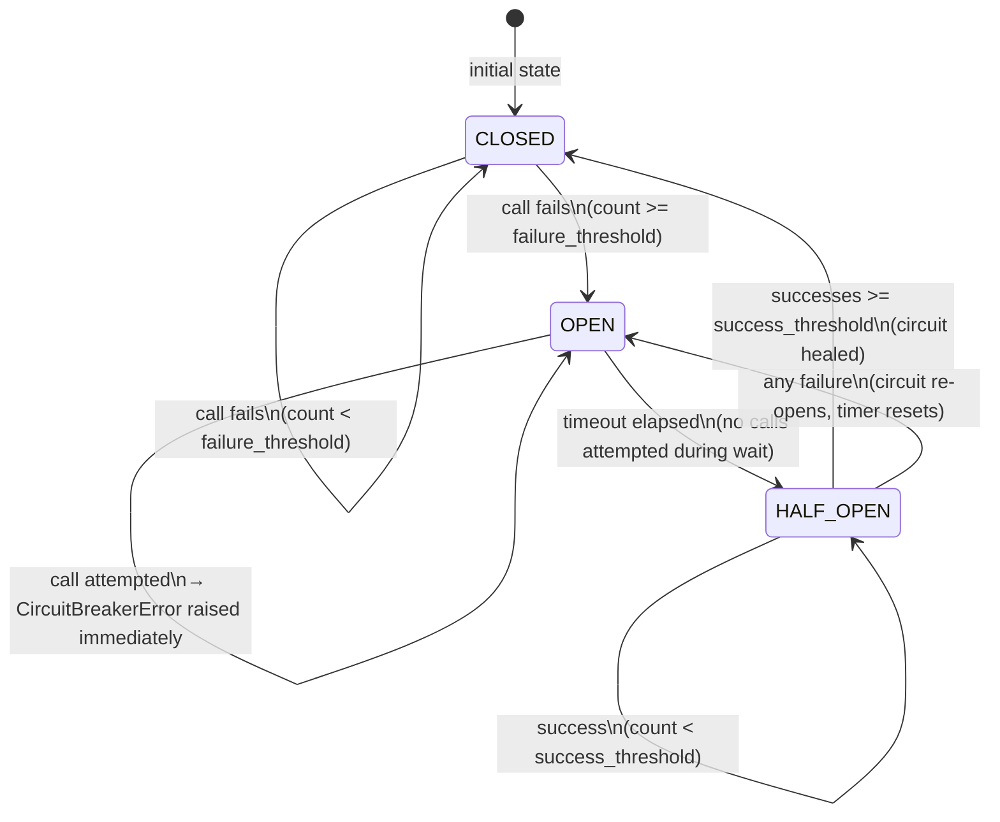

# State Diagram — Circuit Breaker

The circuit breaker has three states. Transitions are triggered by failure counts,
success counts, and elapsed time.

## Transition Conditions

| From       | To         | Condition                                              |
|------------|------------|--------------------------------------------------------|
| CLOSED     | OPEN       | Consecutive failures reach `failure_threshold`         |
| OPEN       | HALF_OPEN  | `timeout` seconds have elapsed since the breaker opened|
| HALF_OPEN  | CLOSED     | Consecutive successes reach `success_threshold`        |
| HALF_OPEN  | OPEN       | Any single failure — timer resets                      |
