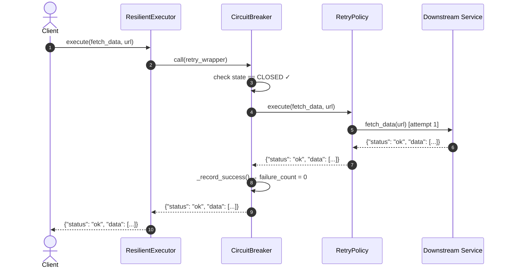

# Sequence Diagram — Scenario 1: Successful Call (No Retry Needed)

The happy path. The downstream service responds on the first attempt.
The circuit breaker records a success and resets the failure counter.

