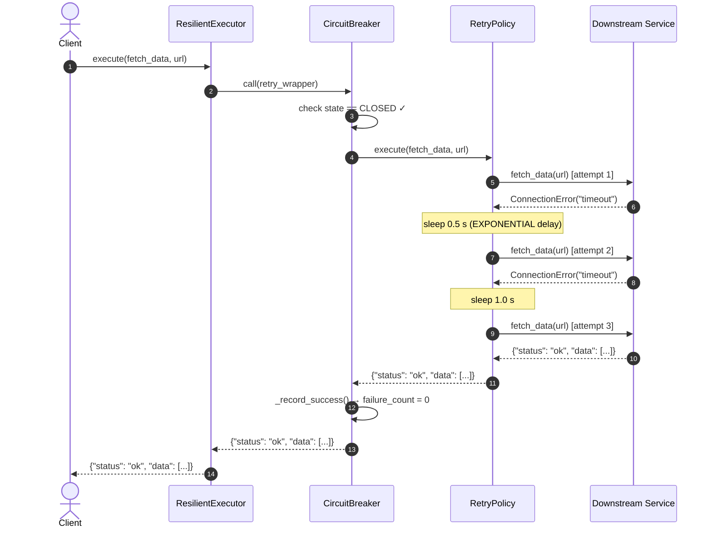

# Sequence Diagram — Scenario 2: Transient Failure, Retries Succeed

The service fails twice with a transient error, then recovers on the third attempt.
The retry policy applies exponential backoff between attempts.
The circuit breaker does not trip because the call ultimately succeeds.

