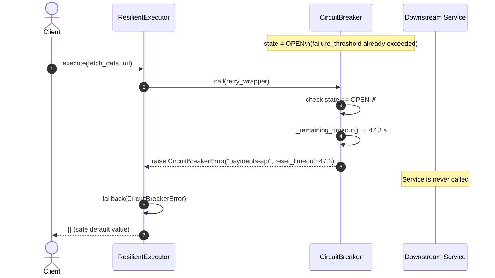

# Sequence Diagram — Scenario 3: Circuit Trips Open → Fallback Returned

The circuit breaker has already accumulated enough failures and is OPEN.
All calls are rejected immediately without touching the downstream service.
The executor's fallback function is invoked instead.

## Notes

- The downstream service receives **zero** requests while the circuit is OPEN.
- The fallback is configured on `ResilientExecutor(fallback=lambda exc: [])`.
- Without a fallback, `CircuitBreakerError` is re-raised to the client.
