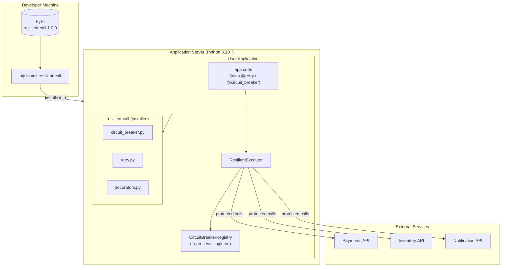

# Deployment Diagram

`resilient-call` is a pure Python library — it ships as a single pip package with
no server-side components and no runtime infrastructure requirements.

## Deployment Notes

| Concern | Detail |
|---|---|
| **Installation** | `pip install resilient-call` — no system dependencies |
| **Python version** | 3.10 or higher |
| **External dependencies** | None |
| **Runtime infrastructure** | None — all state is in-process memory |
| **Multi-replica caveat** | Circuit breaker state is **not shared** across processes or pods. Each replica maintains its own state. For shared state, wrap with a Redis-backed store. |
| **Thread safety** | All state transitions are protected by `threading.Lock` |
| **Async** | Compatible with `asyncio`; use `execute_async` / `execute_async` |
